Customer Segmentation
================

What is Customer Segmentation? Customer segmentation is the practice of
dividing a customer base into groups of individuals that are similar in
specific ways relevant to marketing, such as age, gender, interests and
spending habits.

Benefits of customer segmentation By enabling companies to target
specific groups of customers, a customer segmentation model allows for
the effective allocation of marketing resources and the maximization of
cross- and up-selling opportunities.

## Including Code

You can include R code in the document as follows:

``` r
customer_data=read.csv("C:/Users/senih/OneDrive/Desktop/customer_segmentation_dataset/Mall_Customers.csv")
str(customer_data)
```

    ## 'data.frame':    200 obs. of  5 variables:
    ##  $ CustomerID            : int  1 2 3 4 5 6 7 8 9 10 ...
    ##  $ Gender                : Factor w/ 2 levels "Female","Male": 2 2 1 1 1 1 1 1 2 1 ...
    ##  $ Age                   : int  19 21 20 23 31 22 35 23 64 30 ...
    ##  $ Annual.Income..k..    : int  15 15 16 16 17 17 18 18 19 19 ...
    ##  $ Spending.Score..1.100.: int  39 81 6 77 40 76 6 94 3 72 ...

## Understand the data

We will now display the first six rows of our dataset using the head()
function

``` r
head(customer_data)
```

    ##   CustomerID Gender Age Annual.Income..k.. Spending.Score..1.100.
    ## 1          1   Male  19                 15                     39
    ## 2          2   Male  21                 15                     81
    ## 3          3 Female  20                 16                      6
    ## 4          4 Female  23                 16                     77
    ## 5          5 Female  31                 17                     40
    ## 6          6 Female  22                 17                     76

## Running PCA in R

Before you run a PCA, you should take a look at your data correlation.
If your data is not highly correlated, you might not need a PCA at all\!

\#\#Correlation matrixes (understand the correlation between more than 2
variables)

``` r
ggpairs(customer_data[ , 3:5])
```

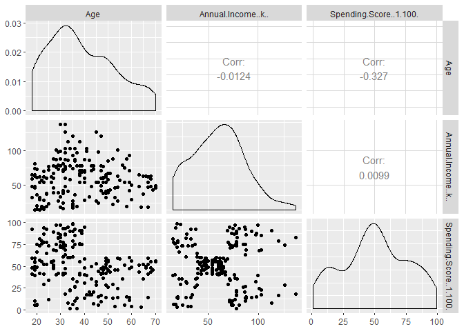<!-- -->

According to the graph above the correlation between variables are not
high. So there is no need for PCA.

## Understand the data

``` r
profiling_num(customer_data)
```

    ##                 variable   mean  std_dev variation_coef  p_01  p_05  p_25
    ## 1             CustomerID 100.50 57.87918      0.5759123  2.99 10.95 50.75
    ## 2                    Age  38.85 13.96901      0.3595626 18.00 19.00 28.75
    ## 3     Annual.Income..k..  60.56 26.26472      0.4336975 15.99 19.00 41.50
    ## 4 Spending.Score..1.100.  50.20 25.82352      0.5144128  2.98  6.00 34.75
    ##    p_50   p_75   p_95   p_99    skewness kurtosis   iqr        range_98
    ## 1 100.5 150.25 190.05 198.01  0.00000000 1.799940 99.50  [2.99, 198.01]
    ## 2  36.0  49.00  66.05  69.01  0.48191947 2.315249 20.25     [18, 69.01]
    ## 3  61.5  78.00 103.00 126.11  0.31942368 2.874107 36.50 [15.99, 126.11]
    ## 4  50.0  73.00  92.00  97.01 -0.04686531 2.164042 38.25   [2.98, 97.01]
    ##        range_80
    ## 1 [20.9, 180.1]
    ## 2    [21, 59.1]
    ## 3  [23.9, 93.4]
    ## 4    [13, 87.1]

According to the table above there is no need to standardize the data.
Because the variances of the variables are pretty close to each other.

``` r
summary(customer_data$Age)
```

    ##    Min. 1st Qu.  Median    Mean 3rd Qu.    Max. 
    ##   18.00   28.75   36.00   38.85   49.00   70.00

``` r
sd(customer_data$Spending.Score..1.100.)
```

    ## [1] 25.82352

## Customer Gender Visualization

``` r
gender_visual = table(customer_data$Gender)

barplot(gender_visual,main="Gender Comparision",
       ylab="Count",
       xlab="Gender",
       col=rainbow(2),
       legend=rownames(gender_visual))
```

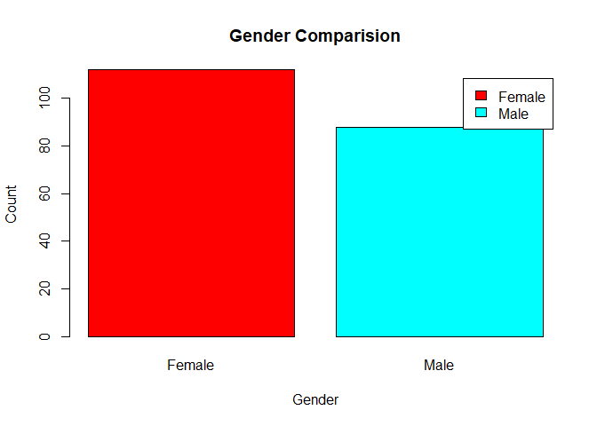<!-- -->

We observed that the number of females is higher than the males. Now,
let us visualize a pie chart to observe the ratio of male and female
distribution.

``` r
pct=round(gender_visual/sum(gender_visual)*100)
lbs=paste(c("Female","Male")," ",pct,"%",sep=" ")
library(plotrix)
pie3D(gender_visual,labels=lbs,
   main="Ratio of Female and Male")
```

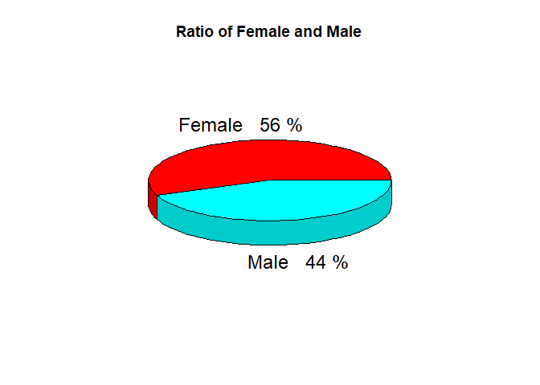<!-- -->

From the above graph, we conclude that the percentage of females is 56%,
whereas the percentage of male in the customer dataset is 44%.

## Visualization of Age Distribution

We will first proceed by taking summary of the Age variable.

``` r
summary(customer_data$Age)
```

    ##    Min. 1st Qu.  Median    Mean 3rd Qu.    Max. 
    ##   18.00   28.75   36.00   38.85   49.00   70.00

``` r
hist(customer_data$Age,
    col="blue",
    main="Count of Age Class",
    xlab="Age Class",
    ylab="Frequency",
    labels=TRUE)
```

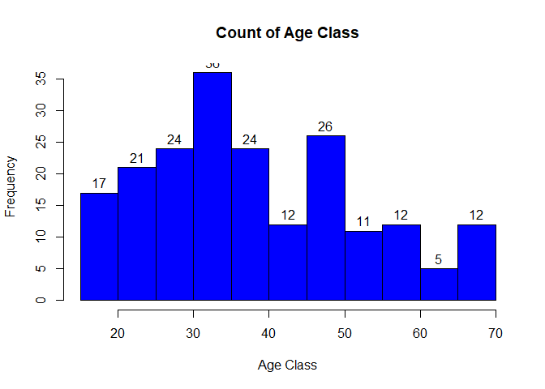<!-- -->

``` r
boxplot(customer_data$Age,
       col="Blue",
       main="Descriptive Analysis of Age")
```

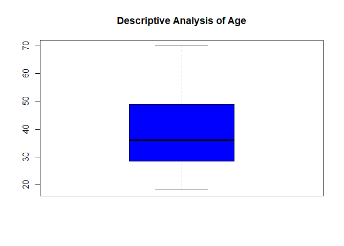<!-- -->

From the above two visualizations, we conclude that the maximum customer
ages are between 30 and 35. The minimum age of customers is 18, whereas,
the maximum age is 70.

## Analysis of the Annual Income of the Customers

In this section of the R project, we will create visualizations to
analyze the annual income of the customers. We will plot a histogram and
then we will proceed to examine this data using a density plot.

``` r
summary(customer_data$Annual.Income..k..)
```

    ##    Min. 1st Qu.  Median    Mean 3rd Qu.    Max. 
    ##   15.00   41.50   61.50   60.56   78.00  137.00

``` r
hist(customer_data$Annual.Income..k..,
  col="Blue",
  main="Annual Income",
  xlab="Annual Income Class",
  ylab="Frequency",
  labels=TRUE)
```

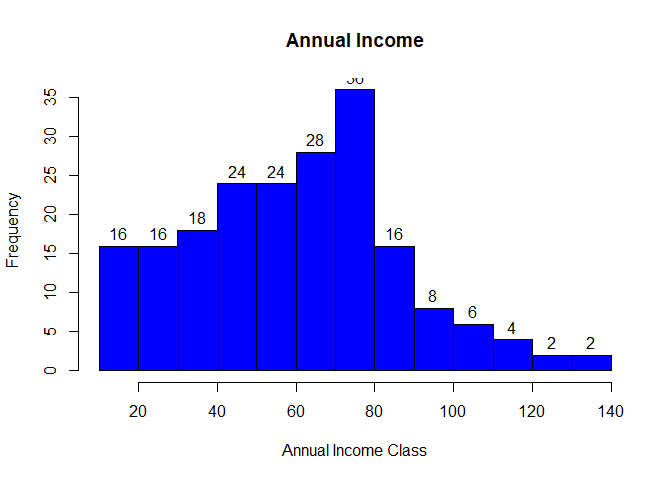<!-- -->

``` r
plot(density(customer_data$Annual.Income..k..),
    col="yellow",
    main="Density Plot for Annual Income",
    xlab="Annual Income Class",
    ylab="Density")
polygon(density(customer_data$Annual.Income..k..),
        col="#ccff66")
```

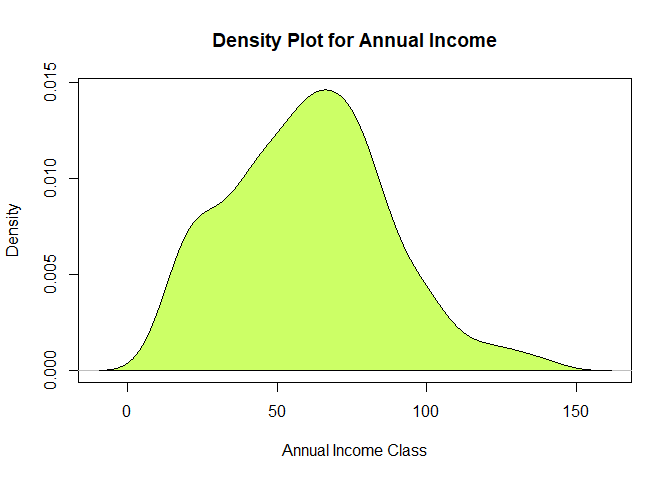<!-- -->

From the above descriptive analysis, we conclude that the minimum annual
income of the customers is 15 and the maximum income is 137. People
earning an average income of 70 have the highest frequency count in our
histogram distribution. The average salary of all the customers is
60.56. In the Kernel Density Plot that we displayed above, we observe
that the annual income has a normal distribution.

## Analyzing Spending Score of the Customers

``` r
summary(customer_data$Spending.Score..1.100.)
```

    ##    Min. 1st Qu.  Median    Mean 3rd Qu.    Max. 
    ##    1.00   34.75   50.00   50.20   73.00   99.00

``` r
boxplot(customer_data$Spending.Score..1.100.,
   horizontal=TRUE,
   col="Red",
   main="Descriptive Analysis of Spending Score")
```

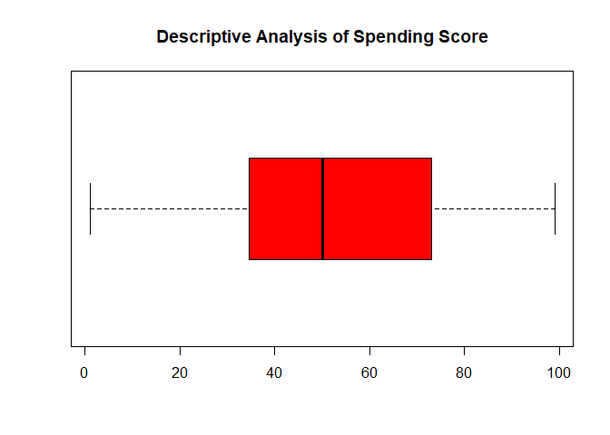<!-- -->

``` r
hist(customer_data$Spending.Score..1.100.,
    main="Spending Score",

        xlab="Spending Score Class",
    ylab="Frequency",
    col="Red",
    labels=TRUE)
```

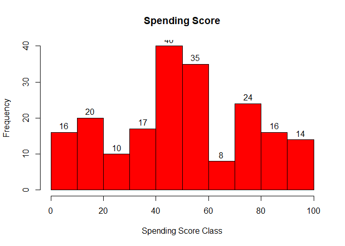<!-- -->

The minimum spending score is 1, maximum is 99 and the average is 50.20.
We can see Descriptive Analysis of Spending Score is that Min is 1, Max
is 99 and avg. is 50.20. From the histogram, we conclude that customers
between class 40 and 50 have the highest spending score among all the
classes.

## K-means Algorithm

While using the k-means clustering algorithm, the first step is to
indicate the number of clusters (k) that we wish to produce in the final
output.

### Finding optimum cluster number with Elbow method

``` r
set.seed(123)

fviz_nbclust(customer_data[ , 3:5], kmeans, method = "wss")
```

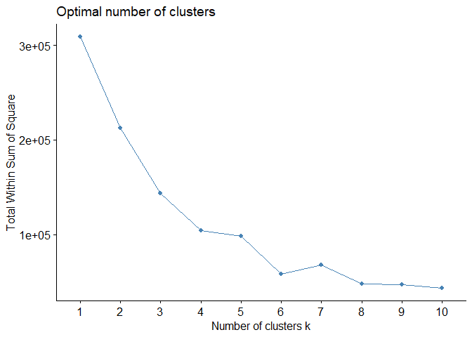<!-- -->

From the above graph, we conclude that 6 is the appropriate number of
clusters since it seems to be appearing at the bend in the elbow plot.

### Finding optimum cluster number with Silhouette method

``` r
fviz_nbclust(customer_data[ , 3:5], kmeans, method = "silhouette")
```

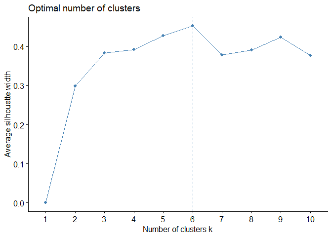<!-- -->

As you see from the above graph, we conclude that 6 is the appropriate
number of clusters according to silhouette method.

### Finding optimum cluster number with Gap statistics method

``` r
set.seed(123)
gap_stat <- clusGap(customer_data[ , 3:5], FUN = kmeans, nstart = 25, K.max = 10, B = 50)
print(gap_stat, method = "firstmax")
```

    ## Clustering Gap statistic ["clusGap"] from call:
    ## clusGap(x = customer_data[, 3:5], FUNcluster = kmeans, K.max = 10,     B = 50, nstart = 25)
    ## B=50 simulated reference sets, k = 1..10; spaceH0="scaledPCA"
    ##  --> Number of clusters (method 'firstmax'): 1
    ##           logW   E.logW       gap     SE.sim
    ##  [1,] 7.829990 8.269156 0.4391660 0.02019110
    ##  [2,] 7.625794 8.028688 0.4028939 0.01819356
    ##  [3,] 7.417921 7.833125 0.4152046 0.01830737
    ##  [4,] 7.256540 7.682002 0.4254622 0.02100410
    ##  [5,] 7.104745 7.602685 0.4979402 0.01822540
    ##  [6,] 6.965334 7.533818 0.5684832 0.01682332
    ##  [7,] 6.903828 7.471733 0.5679041 0.01623561
    ##  [8,] 6.847482 7.417950 0.5704682 0.01694642
    ##  [9,] 6.803046 7.370316 0.5672698 0.01744320
    ## [10,] 6.749955 7.324903 0.5749475 0.01638668

``` r
fviz_gap_stat(gap_stat)
```

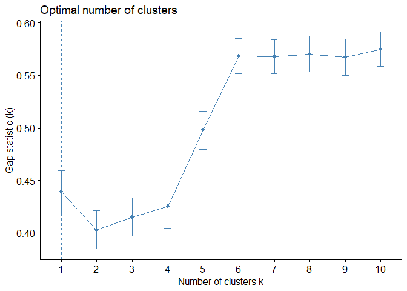<!-- -->

As you see from the above graph, we conclude that 6 is the appropriate
number of clusters according to Gap statistics method.

All three methods shows us the optimum cluster number should be 6. Now,
let us take k = 6 as our optimal cluster.

## K Means CLuster

``` r
set.seed(123)
final <- kmeans(customer_data[ , 3:5], 6, nstart = 25)
print(final)
```

    ## K-means clustering with 6 clusters of sizes 38, 45, 22, 21, 39, 35
    ## 
    ## Cluster means:
    ##        Age Annual.Income..k.. Spending.Score..1.100.
    ## 1 27.00000           56.65789               49.13158
    ## 2 56.15556           53.37778               49.08889
    ## 3 25.27273           25.72727               79.36364
    ## 4 44.14286           25.14286               19.52381
    ## 5 32.69231           86.53846               82.12821
    ## 6 41.68571           88.22857               17.28571
    ## 
    ## Clustering vector:
    ##   [1] 4 3 4 3 4 3 4 3 4 3 4 3 4 3 4 3 4 3 4 3 4 3 4 3 4 3 4 3 4 3 4 3 4 3 4
    ##  [36] 3 4 3 4 3 2 3 2 1 4 3 2 1 1 1 2 1 1 2 2 2 2 2 1 2 2 1 2 2 2 1 2 2 1 1
    ##  [71] 2 2 2 2 2 1 2 1 1 2 2 1 2 2 1 2 2 1 1 2 2 1 2 1 1 1 2 1 2 1 1 2 2 1 2
    ## [106] 1 2 2 2 2 2 1 1 1 1 1 2 2 2 2 1 1 1 5 1 5 6 5 6 5 6 5 1 5 6 5 6 5 6 5
    ## [141] 6 5 1 5 6 5 6 5 6 5 6 5 6 5 6 5 6 5 6 5 6 5 6 5 6 5 6 5 6 5 6 5 6 5 6
    ## [176] 5 6 5 6 5 6 5 6 5 6 5 6 5 6 5 6 5 6 5 6 5 6 5 6 5
    ## 
    ## Within cluster sum of squares by cluster:
    ## [1]  7742.895  8062.133  4099.818  7732.381 13972.359 16690.857
    ##  (between_SS / total_SS =  81.1 %)
    ## 
    ## Available components:
    ## 
    ## [1] "cluster"      "centers"      "totss"        "withinss"    
    ## [5] "tot.withinss" "betweenss"    "size"         "iter"        
    ## [9] "ifault"

In the output of our kmeans operation, we observe a list with several
key information. From this, we conclude the useful information being

\-cluster – This is a vector of several integers that denote the cluster
which has an allocation of each point. -totss – This represents the
total sum of squares. -centers – Matrix comprising of several cluster
centers -withinss – This is a vector representing the intra-cluster sum
of squares having one component per cluster. -tot.withinss – This
denotes the total intra-cluster sum of squares. -betweenss – This is the
sum of between-cluster squares. -size – The total number of points that
each cluster holds.

## Combine cluster data with the customer\_data

``` r
cbind(customer_data, Cluster = final$cluster) -> final_data  
print(final_data) # see the table
```

    ##     CustomerID Gender Age Annual.Income..k.. Spending.Score..1.100.
    ## 1            1   Male  19                 15                     39
    ## 2            2   Male  21                 15                     81
    ## 3            3 Female  20                 16                      6
    ## 4            4 Female  23                 16                     77
    ## 5            5 Female  31                 17                     40
    ## 6            6 Female  22                 17                     76
    ## 7            7 Female  35                 18                      6
    ## 8            8 Female  23                 18                     94
    ## 9            9   Male  64                 19                      3
    ## 10          10 Female  30                 19                     72
    ## 11          11   Male  67                 19                     14
    ## 12          12 Female  35                 19                     99
    ## 13          13 Female  58                 20                     15
    ## 14          14 Female  24                 20                     77
    ## 15          15   Male  37                 20                     13
    ## 16          16   Male  22                 20                     79
    ## 17          17 Female  35                 21                     35
    ## 18          18   Male  20                 21                     66
    ## 19          19   Male  52                 23                     29
    ## 20          20 Female  35                 23                     98
    ## 21          21   Male  35                 24                     35
    ## 22          22   Male  25                 24                     73
    ## 23          23 Female  46                 25                      5
    ## 24          24   Male  31                 25                     73
    ## 25          25 Female  54                 28                     14
    ## 26          26   Male  29                 28                     82
    ## 27          27 Female  45                 28                     32
    ## 28          28   Male  35                 28                     61
    ## 29          29 Female  40                 29                     31
    ## 30          30 Female  23                 29                     87
    ## 31          31   Male  60                 30                      4
    ## 32          32 Female  21                 30                     73
    ## 33          33   Male  53                 33                      4
    ## 34          34   Male  18                 33                     92
    ## 35          35 Female  49                 33                     14
    ## 36          36 Female  21                 33                     81
    ## 37          37 Female  42                 34                     17
    ## 38          38 Female  30                 34                     73
    ## 39          39 Female  36                 37                     26
    ## 40          40 Female  20                 37                     75
    ## 41          41 Female  65                 38                     35
    ## 42          42   Male  24                 38                     92
    ## 43          43   Male  48                 39                     36
    ## 44          44 Female  31                 39                     61
    ## 45          45 Female  49                 39                     28
    ## 46          46 Female  24                 39                     65
    ## 47          47 Female  50                 40                     55
    ## 48          48 Female  27                 40                     47
    ## 49          49 Female  29                 40                     42
    ## 50          50 Female  31                 40                     42
    ## 51          51 Female  49                 42                     52
    ## 52          52   Male  33                 42                     60
    ## 53          53 Female  31                 43                     54
    ## 54          54   Male  59                 43                     60
    ## 55          55 Female  50                 43                     45
    ## 56          56   Male  47                 43                     41
    ## 57          57 Female  51                 44                     50
    ## 58          58   Male  69                 44                     46
    ## 59          59 Female  27                 46                     51
    ## 60          60   Male  53                 46                     46
    ## 61          61   Male  70                 46                     56
    ## 62          62   Male  19                 46                     55
    ## 63          63 Female  67                 47                     52
    ## 64          64 Female  54                 47                     59
    ## 65          65   Male  63                 48                     51
    ## 66          66   Male  18                 48                     59
    ## 67          67 Female  43                 48                     50
    ## 68          68 Female  68                 48                     48
    ## 69          69   Male  19                 48                     59
    ## 70          70 Female  32                 48                     47
    ## 71          71   Male  70                 49                     55
    ## 72          72 Female  47                 49                     42
    ## 73          73 Female  60                 50                     49
    ## 74          74 Female  60                 50                     56
    ## 75          75   Male  59                 54                     47
    ## 76          76   Male  26                 54                     54
    ## 77          77 Female  45                 54                     53
    ## 78          78   Male  40                 54                     48
    ## 79          79 Female  23                 54                     52
    ## 80          80 Female  49                 54                     42
    ## 81          81   Male  57                 54                     51
    ## 82          82   Male  38                 54                     55
    ## 83          83   Male  67                 54                     41
    ## 84          84 Female  46                 54                     44
    ## 85          85 Female  21                 54                     57
    ## 86          86   Male  48                 54                     46
    ## 87          87 Female  55                 57                     58
    ## 88          88 Female  22                 57                     55
    ## 89          89 Female  34                 58                     60
    ## 90          90 Female  50                 58                     46
    ## 91          91 Female  68                 59                     55
    ## 92          92   Male  18                 59                     41
    ## 93          93   Male  48                 60                     49
    ## 94          94 Female  40                 60                     40
    ## 95          95 Female  32                 60                     42
    ## 96          96   Male  24                 60                     52
    ## 97          97 Female  47                 60                     47
    ## 98          98 Female  27                 60                     50
    ## 99          99   Male  48                 61                     42
    ## 100        100   Male  20                 61                     49
    ## 101        101 Female  23                 62                     41
    ## 102        102 Female  49                 62                     48
    ## 103        103   Male  67                 62                     59
    ## 104        104   Male  26                 62                     55
    ## 105        105   Male  49                 62                     56
    ## 106        106 Female  21                 62                     42
    ## 107        107 Female  66                 63                     50
    ## 108        108   Male  54                 63                     46
    ## 109        109   Male  68                 63                     43
    ## 110        110   Male  66                 63                     48
    ## 111        111   Male  65                 63                     52
    ## 112        112 Female  19                 63                     54
    ## 113        113 Female  38                 64                     42
    ## 114        114   Male  19                 64                     46
    ## 115        115 Female  18                 65                     48
    ## 116        116 Female  19                 65                     50
    ## 117        117 Female  63                 65                     43
    ## 118        118 Female  49                 65                     59
    ## 119        119 Female  51                 67                     43
    ## 120        120 Female  50                 67                     57
    ## 121        121   Male  27                 67                     56
    ## 122        122 Female  38                 67                     40
    ## 123        123 Female  40                 69                     58
    ## 124        124   Male  39                 69                     91
    ## 125        125 Female  23                 70                     29
    ## 126        126 Female  31                 70                     77
    ## 127        127   Male  43                 71                     35
    ## 128        128   Male  40                 71                     95
    ## 129        129   Male  59                 71                     11
    ## 130        130   Male  38                 71                     75
    ## 131        131   Male  47                 71                      9
    ## 132        132   Male  39                 71                     75
    ## 133        133 Female  25                 72                     34
    ## 134        134 Female  31                 72                     71
    ## 135        135   Male  20                 73                      5
    ## 136        136 Female  29                 73                     88
    ## 137        137 Female  44                 73                      7
    ## 138        138   Male  32                 73                     73
    ## 139        139   Male  19                 74                     10
    ## 140        140 Female  35                 74                     72
    ## 141        141 Female  57                 75                      5
    ## 142        142   Male  32                 75                     93
    ## 143        143 Female  28                 76                     40
    ## 144        144 Female  32                 76                     87
    ## 145        145   Male  25                 77                     12
    ## 146        146   Male  28                 77                     97
    ## 147        147   Male  48                 77                     36
    ## 148        148 Female  32                 77                     74
    ## 149        149 Female  34                 78                     22
    ## 150        150   Male  34                 78                     90
    ## 151        151   Male  43                 78                     17
    ## 152        152   Male  39                 78                     88
    ## 153        153 Female  44                 78                     20
    ## 154        154 Female  38                 78                     76
    ## 155        155 Female  47                 78                     16
    ## 156        156 Female  27                 78                     89
    ## 157        157   Male  37                 78                      1
    ## 158        158 Female  30                 78                     78
    ## 159        159   Male  34                 78                      1
    ## 160        160 Female  30                 78                     73
    ## 161        161 Female  56                 79                     35
    ## 162        162 Female  29                 79                     83
    ## 163        163   Male  19                 81                      5
    ## 164        164 Female  31                 81                     93
    ## 165        165   Male  50                 85                     26
    ## 166        166 Female  36                 85                     75
    ## 167        167   Male  42                 86                     20
    ## 168        168 Female  33                 86                     95
    ## 169        169 Female  36                 87                     27
    ## 170        170   Male  32                 87                     63
    ## 171        171   Male  40                 87                     13
    ## 172        172   Male  28                 87                     75
    ## 173        173   Male  36                 87                     10
    ## 174        174   Male  36                 87                     92
    ## 175        175 Female  52                 88                     13
    ## 176        176 Female  30                 88                     86
    ## 177        177   Male  58                 88                     15
    ## 178        178   Male  27                 88                     69
    ## 179        179   Male  59                 93                     14
    ## 180        180   Male  35                 93                     90
    ## 181        181 Female  37                 97                     32
    ## 182        182 Female  32                 97                     86
    ## 183        183   Male  46                 98                     15
    ## 184        184 Female  29                 98                     88
    ## 185        185 Female  41                 99                     39
    ## 186        186   Male  30                 99                     97
    ## 187        187 Female  54                101                     24
    ## 188        188   Male  28                101                     68
    ## 189        189 Female  41                103                     17
    ## 190        190 Female  36                103                     85
    ## 191        191 Female  34                103                     23
    ## 192        192 Female  32                103                     69
    ## 193        193   Male  33                113                      8
    ## 194        194 Female  38                113                     91
    ## 195        195 Female  47                120                     16
    ## 196        196 Female  35                120                     79
    ## 197        197 Female  45                126                     28
    ## 198        198   Male  32                126                     74
    ## 199        199   Male  32                137                     18
    ## 200        200   Male  30                137                     83
    ##     Cluster
    ## 1         4
    ## 2         3
    ## 3         4
    ## 4         3
    ## 5         4
    ## 6         3
    ## 7         4
    ## 8         3
    ## 9         4
    ## 10        3
    ## 11        4
    ## 12        3
    ## 13        4
    ## 14        3
    ## 15        4
    ## 16        3
    ## 17        4
    ## 18        3
    ## 19        4
    ## 20        3
    ## 21        4
    ## 22        3
    ## 23        4
    ## 24        3
    ## 25        4
    ## 26        3
    ## 27        4
    ## 28        3
    ## 29        4
    ## 30        3
    ## 31        4
    ## 32        3
    ## 33        4
    ## 34        3
    ## 35        4
    ## 36        3
    ## 37        4
    ## 38        3
    ## 39        4
    ## 40        3
    ## 41        2
    ## 42        3
    ## 43        2
    ## 44        1
    ## 45        4
    ## 46        3
    ## 47        2
    ## 48        1
    ## 49        1
    ## 50        1
    ## 51        2
    ## 52        1
    ## 53        1
    ## 54        2
    ## 55        2
    ## 56        2
    ## 57        2
    ## 58        2
    ## 59        1
    ## 60        2
    ## 61        2
    ## 62        1
    ## 63        2
    ## 64        2
    ## 65        2
    ## 66        1
    ## 67        2
    ## 68        2
    ## 69        1
    ## 70        1
    ## 71        2
    ## 72        2
    ## 73        2
    ## 74        2
    ## 75        2
    ## 76        1
    ## 77        2
    ## 78        1
    ## 79        1
    ## 80        2
    ## 81        2
    ## 82        1
    ## 83        2
    ## 84        2
    ## 85        1
    ## 86        2
    ## 87        2
    ## 88        1
    ## 89        1
    ## 90        2
    ## 91        2
    ## 92        1
    ## 93        2
    ## 94        1
    ## 95        1
    ## 96        1
    ## 97        2
    ## 98        1
    ## 99        2
    ## 100       1
    ## 101       1
    ## 102       2
    ## 103       2
    ## 104       1
    ## 105       2
    ## 106       1
    ## 107       2
    ## 108       2
    ## 109       2
    ## 110       2
    ## 111       2
    ## 112       1
    ## 113       1
    ## 114       1
    ## 115       1
    ## 116       1
    ## 117       2
    ## 118       2
    ## 119       2
    ## 120       2
    ## 121       1
    ## 122       1
    ## 123       1
    ## 124       5
    ## 125       1
    ## 126       5
    ## 127       6
    ## 128       5
    ## 129       6
    ## 130       5
    ## 131       6
    ## 132       5
    ## 133       1
    ## 134       5
    ## 135       6
    ## 136       5
    ## 137       6
    ## 138       5
    ## 139       6
    ## 140       5
    ## 141       6
    ## 142       5
    ## 143       1
    ## 144       5
    ## 145       6
    ## 146       5
    ## 147       6
    ## 148       5
    ## 149       6
    ## 150       5
    ## 151       6
    ## 152       5
    ## 153       6
    ## 154       5
    ## 155       6
    ## 156       5
    ## 157       6
    ## 158       5
    ## 159       6
    ## 160       5
    ## 161       6
    ## 162       5
    ## 163       6
    ## 164       5
    ## 165       6
    ## 166       5
    ## 167       6
    ## 168       5
    ## 169       6
    ## 170       5
    ## 171       6
    ## 172       5
    ## 173       6
    ## 174       5
    ## 175       6
    ## 176       5
    ## 177       6
    ## 178       5
    ## 179       6
    ## 180       5
    ## 181       6
    ## 182       5
    ## 183       6
    ## 184       5
    ## 185       6
    ## 186       5
    ## 187       6
    ## 188       5
    ## 189       6
    ## 190       5
    ## 191       6
    ## 192       5
    ## 193       6
    ## 194       5
    ## 195       6
    ## 196       5
    ## 197       6
    ## 198       5
    ## 199       6
    ## 200       5

## VISUALIZE CLUSTERS

``` r
fviz_cluster(final, data = customer_data[ , 3:5])
```

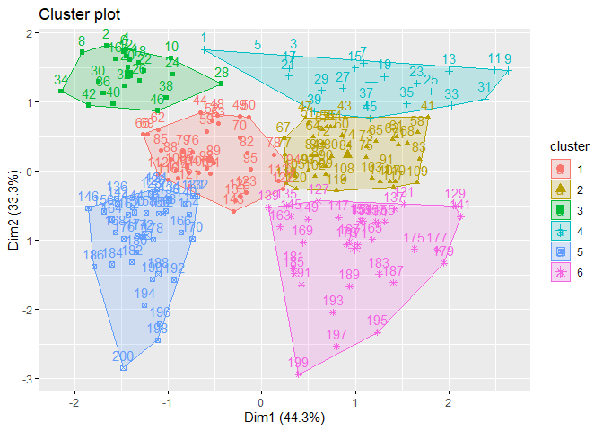<!-- -->

## Descriptive statistics according to clusters

``` r
customer_data[ , 3:5] %>%
  mutate(Cluster = final$cluster) %>%
  group_by(Cluster) %>%
  summarise_all("mean")
```

    ## # A tibble: 6 x 4
    ##   Cluster   Age Annual.Income..k.. Spending.Score..1.100.
    ##     <int> <dbl>              <dbl>                  <dbl>
    ## 1       1  27                 56.7                   49.1
    ## 2       2  56.2               53.4                   49.1
    ## 3       3  25.3               25.7                   79.4
    ## 4       4  44.1               25.1                   19.5
    ## 5       5  32.7               86.5                   82.1
    ## 6       6  41.7               88.2                   17.3

As you see from the above table, we see mean values of each cluster.

## Visualizing the Clustering Results using the First Two Principle Components

``` r
pcclust=prcomp(customer_data[,3:5],scale=FALSE) # 3 PC are created (principal component analysis)
summary(pcclust)
```

    ## Importance of components:
    ##                            PC1     PC2     PC3
    ## Standard deviation     26.4625 26.1597 12.9317
    ## Proportion of Variance  0.4512  0.4410  0.1078
    ## Cumulative Proportion   0.4512  0.8922  1.0000

The higher variance means the higher importance. So we will use PC1 and
PC2 below.

``` r
pcclust$rotation[,1:2] 
```

    ##                               PC1        PC2
    ## Age                     0.1889742 -0.1309652
    ## Annual.Income..k..     -0.5886410 -0.8083757
    ## Spending.Score..1.100. -0.7859965  0.5739136

If the PC number is positive, the variable positively contributes to the
component. If it’s negative, then they are negatively related. Larger
the number, stronger the relationship. Spending score variable in PC1
has negatively strong relationship. And Annual Income in PC2 has
negatively strong relationship.

## Visualizing clusters according to Annual Income and Spending Score

``` r
set.seed(1)
ggplot(customer_data, aes(x =Annual.Income..k.., y = Spending.Score..1.100.)) + 
  geom_point(stat = "identity", aes(color = as.factor(final$cluster))) +
  scale_color_discrete(name=" ",
              breaks=c("1", "2", "3", "4", "5","6"),
              labels=c("Cluster 1", "Cluster 2", "Cluster 3", "Cluster 4", "Cluster 5","Cluster 6")) +
  ggtitle("Segments of Mall Customers", subtitle = "Using K-means Clustering")
```

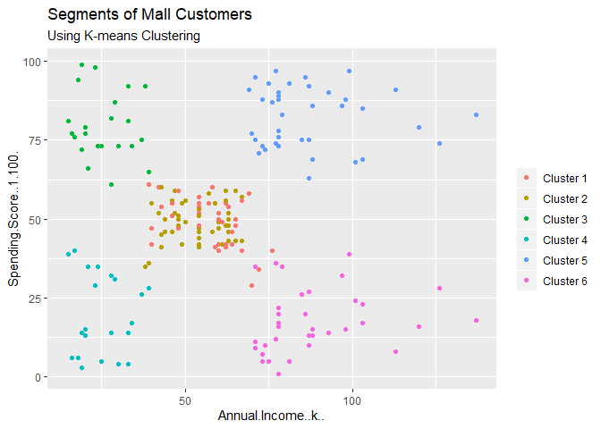<!-- -->

From the above visualization, we observe that there is a distribution of
6 clusters as follows –

\-Cluster 6 and 5 – These clusters represent the customer\_data with the
medium income salary as well as the medium annual spend of salary.

\-Cluster 3 – This cluster represents the customer\_data having a high
annual income as well as a high annual spend.

\-Cluster 1 – This cluster denotes the customer\_data with low annual
income as well as low yearly spend of income.

\-Cluster 4 – This cluster denotes a high annual income and low yearly
spend.

\-Cluster 2 – This cluster represents a low annual income but its high
yearly expenditure.

## Visualizing clusters according to Age and Spending Score

``` r
ggplot(customer_data, aes(x =Spending.Score..1.100., y =Age)) + 
  geom_point(stat = "identity", aes(color = as.factor(final$cluster))) +
  scale_color_discrete(name=" ",
                      breaks=c("1", "2", "3", "4", "5","6"),
                      labels=c("Cluster 1", "Cluster 2", "Cluster 3", "Cluster 4", "Cluster 5","Cluster 6")) +
  ggtitle("Segments of Mall Customers", subtitle = "Using K-means Clustering")
```

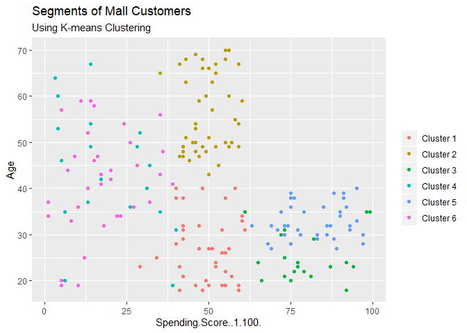<!-- -->

``` r
kCols=function(vec){cols=rainbow (length (unique (vec)))
return (cols[as.numeric(as.factor(vec))])}

digCluster<-final$cluster; 
dignm<-as.character(digCluster); # K-means clusters

plot(pcclust$x[,1:2], 
     col =kCols(digCluster),
     pch =19,xlab ="K-means",
     ylab="classes")
legend("bottomleft",unique(dignm),
       fill=unique(kCols(digCluster)))
```

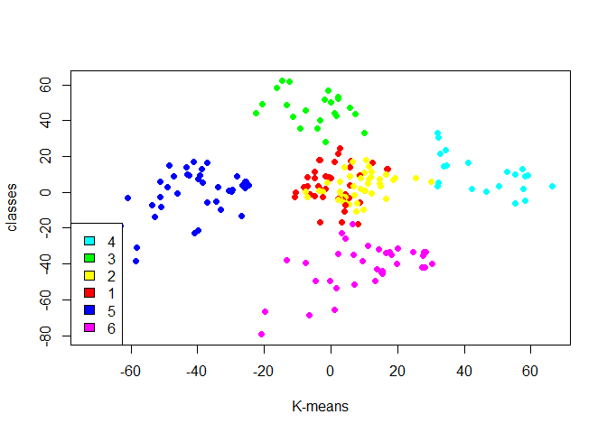<!-- -->

Cluster 5 and 6 – These two clusters consist of customers with medium
PCA1 and medium PCA2 score.

Cluster 3 – This cluster represents customers having a high PCA2 and a
low PCA1.

Cluster 4 – In this cluster, there are customers with a medium PCA1 and
a low PCA2 score.

Cluster 1 – This cluster comprises of customers with a high PCA1 income
and a high PCA2.

Cluster 2 – This comprises of customers with a high PCA2 and a medium
annual spend of income.

With the help of clustering, we can understand the variables much
better, prompting us to take careful decisions. With the identification
of customers, companies can release products and services that target
customers based on several parameters like income, age, spending
patterns, etc. Furthermore, more complex patterns like product reviews
are taken into consideration for better segmentation.

Summary In this data science project, we went through the customer
segmentation model. We developed this using a class of machine learning
known as unsupervised learning. Specifically, we made use of a
clustering algorithm called K-means clustering. We analyzed and
visualized the data and then proceeded to implement our algorithm.
